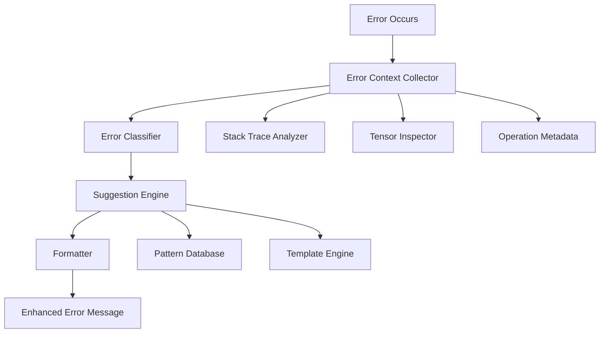

# Contribution Proposal: Context-Aware Error Messages for PyTorch

## Executive Summary

**Goal**: Enhance PyTorch's error messages with intelligent context and suggestions to help developers quickly identify and fix common issues.

**Impact**: Improves developer experience for millions of PyTorch users, especially beginners  
**Effort**: 2-3 months (Medium)  
**Complexity**: Low-Medium barrier to entry

---

## Problem Statement

### Current Pain Points

1. **Cryptic Error Messages**
   ```python
   # Current error
   RuntimeError: Expected all tensors to be on the same device, but found at least two devices, cuda:0 and cpu!
   ```
   - Users don't know WHERE the mismatch occurred
   - No suggestion on HOW to fix it
   - No context about which tensors are problematic

2. **Dimension Mismatch Confusion**
   ```python
   # Current error
   RuntimeError: mat1 and mat2 shapes cannot be multiplied (128x512 and 256x128)
   ```
   - Unclear which operation caused this
   - No explanation of expected shapes
   - No guidance on fixing the issue

3. **Type Errors**
   ```python
   # Current error
   TypeError: can't convert cuda:0 device type tensor to numpy. Use Tensor.cpu() to copy the tensor to host memory first.
   ```
   - This one is actually good! But inconsistent across error types

### User Impact

- **Beginners**: Spend hours debugging simple issues
- **Intermediate**: Lose productivity on context switching
- **Advanced**: Less affected but still benefit from faster debugging
- **Teaching**: Instructors spend less time explaining common errors

---

## Proposed Solution

### Enhanced Error Message System

#### 1. Contextual Information Layer
Add context about:
- Which operation failed
- Stack trace with relevant user code (filter out framework internals)
- Variable names and shapes involved
- Device locations

#### 2. Intelligent Suggestions
Based on error type, provide:
- Common fixes (with code snippets)
- Links to relevant documentation
- Similar issues from community forums

#### 3. Progressive Disclosure
- **Concise mode** (default): Error + one-line hint
- **Verbose mode** (`PYTORCH_ERROR_VERBOSE=1`): Full context + suggestions
- **Debug mode** (`PYTORCH_ERROR_DEBUG=1`): Complete stack trace + internal details

---

## Technical Design

### Architecture



### Core Components

#### 1. Error Context Collector (`torch/error_context.py`)
```python
class ErrorContext:
    """Collects contextual information about errors"""
    
    def __init__(self, error_type: str):
        self.error_type = error_type
        self.tensors_involved: List[TensorInfo] = []
        self.operation_name: Optional[str] = None
        self.user_stack_trace: List[StackFrame] = []
        self.suggested_fixes: List[str] = []
    
    def add_tensor(self, tensor: Tensor, name: str = ""):
        """Record tensor metadata (shape, device, dtype)"""
        
    def add_operation(self, op_name: str, inputs: List, outputs: List):
        """Record operation that failed"""
        
    def analyze_stack(self) -> List[StackFrame]:
        """Extract user code from stack trace, filtering framework code"""
```

#### 2. Error Classifier (`torch/csrc/error_classifier.cpp`)
```cpp
enum class ErrorCategory {
    DEVICE_MISMATCH,
    SHAPE_MISMATCH,
    TYPE_MISMATCH,
    OUT_OF_MEMORY,
    GRADIENT_ERROR,
    NUMERICAL_ERROR,
    API_MISUSE,
    UNKNOWN
};

class ErrorClassifier {
public:
    ErrorCategory classify(const std::exception& error);
    std::vector<std::string> suggest_fixes(ErrorCategory category, ErrorContext ctx);
};
```

#### 3. Suggestion Engine (`torch/error_suggestions.py`)
```python
class SuggestionEngine:
    """Generates helpful suggestions based on error patterns"""
    
    SUGGESTIONS = {
        'device_mismatch': [
            "Move all tensors to the same device: tensor.to(device)",
            "Ensure model and data are on the same device: model.to(device)",
            "Check if you're mixing CPU and GPU tensors in operations"
        ],
        'shape_mismatch': [
            "Use tensor.view() or tensor.reshape() to adjust dimensions",
            "Check input shapes: print(tensor.shape)",
            "Use torch.nn.Linear with correct in_features/out_features"
        ],
        # ... more patterns
    }
    
    def get_suggestions(self, error_category: str, context: ErrorContext) -> List[str]:
        """Return contextual suggestions"""
```

#### 4. Enhanced Error Formatter (`torch/error_formatter.py`)
```python
class EnhancedErrorFormatter:
    """Formats errors with context and suggestions"""
    
    def format(self, error: Exception, context: ErrorContext, mode: str = 'concise') -> str:
        """
        Format error message with:
        - Clear error description
        - Contextual information
        - Helpful suggestions
        - Relevant code snippet from user's code
        """
```

---

## Implementation Plan

### Phase 1: Foundation (Weeks 1-3)

**Objective**: Build core infrastructure for error context collection

**Tasks**:
1. Create `ErrorContext` class and metadata structures
2. Implement stack trace filtering (user code vs framework code)
3. Add tensor inspection utilities
4. Create configuration for error verbosity levels

**Files to Create**:
- `torch/error_context.py`
- `torch/error_utils.py`
- `torch/csrc/error_context.cpp` (C++ bindings)

**Expected Output**: Basic error context collection working

### Phase 2: Error Classification (Weeks 4-6)

**Objective**: Categorize common error types

**Tasks**:
1. Analyze top 50 most common PyTorch errors (from GitHub issues/Stack Overflow)
2. Create error taxonomy and classification system
3. Implement pattern matching for error detection
4. Build suggestion database for each error category

**Files to Modify**:
- `torch/csrc/Exceptions.cpp`
- `torch/csrc/autograd/python_engine.cpp`
- `torch/nn/modules/module.py`

**Expected Output**: Errors are automatically classified

### Phase 3: Suggestion Engine (Weeks 7-9)

**Objective**: Generate helpful suggestions for common errors

**Tasks**:
1. Build suggestion templates for top 20 error patterns
2. Implement code snippet generation
3. Add documentation links to suggestions
4. Create A/B testing framework for suggestion quality

**Files to Create**:
- `torch/error_suggestions.py`
- `torch/error_templates.yaml`

**Expected Output**: Contextual suggestions appearing in error messages

### Phase 4: Integration & Polish (Weeks 10-12)

**Objective**: Integrate into PyTorch core and polish UX

**Tasks**:
1. Hook error handlers throughout PyTorch codebase
2. Add configuration options (environment variables)
3. Implement progressive disclosure (concise/verbose/debug modes)
4. Create comprehensive tests for error scenarios
5. Write documentation and migration guide

**Files to Modify**:
- All major error throwing locations in PyTorch
- `torch/__init__.py` (configuration)
- `docs/source/error_messages.rst` (new documentation)

**Expected Output**: Feature fully integrated and documented

---

## Example Enhancements

### Before vs After

#### Example 1: Device Mismatch

**Before**:
```
RuntimeError: Expected all tensors to be on the same device, but found at least two devices, cuda:0 and cpu!
```

**After (Concise)**:
```
RuntimeError: Device mismatch in matrix multiplication
  Found: tensor on cuda:0, tensor on cpu
  Location: model.py:45 in forward()
  
💡 Quick fix: Move all tensors to the same device
   Try: input = input.to(device)
```

**After (Verbose)**:
```
RuntimeError: Device mismatch in matrix multiplication

Context:
  Operation: torch.matmul(input, weight)
  Location: model.py:45 in forward()
  
  Input tensor 'input': shape=(32, 512), device=cuda:0, dtype=float32
  Weight tensor 'weight': shape=(512, 256), device=cpu, dtype=float32

Root Cause:
  Attempting to multiply tensors on different devices (cuda:0 vs cpu)

Suggested Fixes:
  1. Move input to CPU: input = input.cpu()
  2. Move weight to GPU: weight = weight.to('cuda')
  3. Move entire model to GPU: model.to('cuda')

Learn more: https://pytorch.org/docs/stable/notes/cuda.html#device-agnostic-code
```

#### Example 2: Shape Mismatch

**Before**:
```
RuntimeError: mat1 and mat2 shapes cannot be multiplied (128x512 and 256x128)
```

**After (Concise)**:
```
RuntimeError: Shape mismatch in Linear layer
  Expected: (*, 256) → Got: (128, 512)
  Location: model.py:23 in forward()
  
💡 Your Linear layer expects 256 features but got 512
   Check: nn.Linear(in_features=?, out_features=?)
```

**After (Verbose)**:
```
RuntimeError: Shape mismatch in Linear layer

Context:
  Layer: self.fc1 = nn.Linear(in_features=256, out_features=128)
  Input: tensor with shape (128, 512)
  Location: model.py:23 in forward()

Expected Shape: (batch_size, 256)
Received Shape: (128, 512)

Root Cause:
  Your Linear layer is configured for 256 input features, but the tensor has 512 features

Common Causes:
  1. Incorrect in_features when defining nn.Linear
  2. Previous layer output doesn't match this layer's input
  3. Forgot to flatten convolutional output

Suggested Fixes:
  1. Update layer definition: nn.Linear(in_features=512, out_features=128)
  2. Add flatten before this layer: x = x.flatten(start_dim=1)
  3. Check previous layer's output dimensions

Debug:
  Print shapes: print(f"Input shape: {x.shape}")
  
Learn more: https://pytorch.org/docs/stable/generated/torch.nn.Linear.html
```

#### Example 3: Gradient Error

**Before**:
```
RuntimeError: one of the variables needed for gradient computation has been modified by an inplace operation
```

**After**:
```
RuntimeError: Inplace operation modified tensor needed for gradients
  Tensor: 'hidden' in model.py:67
  Operation: relu_() or +=
  
💡 Replace inplace operations during backprop
   Instead of: x.relu_()  →  Use: x = x.relu()
   Instead of: x += 1     →  Use: x = x + 1
   
Learn more about autograd: https://pytorch.org/docs/stable/notes/autograd.html#in-place-operations-with-autograd
```

---

## Testing Strategy

### Unit Tests
```python
# tests/test_error_messages.py

def test_device_mismatch_error():
    """Test enhanced device mismatch error message"""
    model = nn.Linear(10, 5).cuda()
    input = torch.randn(2, 10)  # CPU tensor
    
    with pytest.raises(RuntimeError) as exc_info:
        model(input)
    
    error_msg = str(exc_info.value)
    assert "Device mismatch" in error_msg
    assert "cuda:0" in error_msg
    assert "cpu" in error_msg
    assert "Quick fix" in error_msg or "Suggested Fixes" in error_msg

def test_shape_mismatch_error():
    """Test enhanced shape mismatch error message"""
    model = nn.Linear(256, 128)
    input = torch.randn(32, 512)  # Wrong shape
    
    with pytest.raises(RuntimeError) as exc_info:
        model(input)
    
    error_msg = str(exc_info.value)
    assert "Shape mismatch" in error_msg
    assert "256" in error_msg  # Expected
    assert "512" in error_msg  # Received
```

### Integration Tests
- Test error messages across different modules (nn, autograd, distributed)
- Test error messages in different modes (concise, verbose, debug)
- Test with real-world model architectures

### User Testing
- A/B testing with sample of users (metric: time to fix error)
- Survey about error message helpfulness
- Track GitHub issues mentioning error messages

---

## Performance Considerations

### Overhead Analysis
- Error context collection: ~10-50μs (only on error path)
- Suggestion generation: ~100-500μs (one-time on error)
- **Impact**: Negligible - only affects error path, not happy path

### Memory Impact
- Additional metadata: ~1-5KB per error context
- Suggestion templates: ~100KB (loaded once)
- **Impact**: Minimal

### Optimization Strategies
1. Lazy evaluation: Only collect detailed context if verbose mode enabled
2. Cache suggestions: Reuse patterns for similar errors
3. Async logging: For telemetry/analytics (opt-in)

---

## Configuration API

### Environment Variables
```bash
# Error verbosity levels
export PYTORCH_ERROR_MODE=concise   # Default: brief message + quick fix
export PYTORCH_ERROR_MODE=verbose   # Full context + suggestions
export PYTORCH_ERROR_MODE=debug     # Everything + internal details

# Toggle specific features
export PYTORCH_ERROR_SUGGESTIONS=1  # Show suggestions (default: on)
export PYTORCH_ERROR_CONTEXT=1      # Show context (default: on)
export PYTORCH_ERROR_LINKS=1        # Show doc links (default: on)
```

### Python API
```python
import torch

# Global configuration
torch.errors.set_mode('verbose')
torch.errors.enable_suggestions(True)
torch.errors.enable_context(True)

# Context manager for temporary changes
with torch.errors.verbose():
    # Errors in this block are verbose
    model(input)

# Custom error handlers
@torch.errors.custom_handler(RuntimeError)
def my_handler(error, context):
    # Custom error handling logic
    pass
```

---

## Documentation Plan

### User-Facing Documentation
1. **New Guide**: "Understanding PyTorch Error Messages"
   - How to read enhanced errors
   - How to use different verbosity modes
   - Common errors and solutions

2. **Tutorial**: "Debugging PyTorch Models"
   - Practical examples using enhanced errors
   - Step-by-step debugging workflow

3. **API Reference**: Error configuration options

### Developer Documentation
1. **Contributing Guide Addition**: How to add error suggestions for new error types
2. **Design Doc**: Architecture and implementation details
3. **Error Message Guidelines**: Best practices for writing helpful errors

---

## Migration & Rollout

### Phase 1: Opt-In Beta (1 month)
- Feature behind flag: `PYTORCH_ENHANCED_ERRORS=1`
- Gather feedback from early adopters
- A/B test suggestion quality

### Phase 2: Opt-Out (1 month)
- Enable by default in nightly builds
- Allow opt-out: `PYTORCH_ENHANCED_ERRORS=0`
- Monitor error logs and user feedback

### Phase 3: General Availability
- Ship in next minor version (e.g., PyTorch 2.X)
- Announce in release notes
- Blog post with examples

### Backward Compatibility
- Old error messages still available via `PYTORCH_ERROR_MODE=legacy`
- No breaking changes to error types or inheritance
- Tools parsing errors may need updates (documented)

---

## Success Metrics

### Quantitative
1. **Time to Resolution**: Reduce average time to fix common errors by 30%
2. **GitHub Issues**: Reduce duplicate error-related issues by 20%
3. **Stack Overflow**: Reduce basic error questions by 15%
4. **User Surveys**: >80% find new errors helpful

### Qualitative
1. Positive community feedback on forums/social media
2. Adoption by PyTorch tutorials and courses
3. Fewer "I don't understand this error" questions

---

## Risks & Mitigation

### Risk 1: Suggestions Are Incorrect
**Mitigation**: 
- Conservative approach: Only suggest for well-understood errors
- Allow user feedback: "Was this helpful? Y/N"
- Iterative improvement based on feedback

### Risk 2: Performance Regression
**Mitigation**:
- Comprehensive benchmarking
- Keep overhead on happy path to zero
- Make features toggleable

### Risk 3: Maintenance Burden
**Mitigation**:
- Clear guidelines for adding new suggestions
- Automated tests for error message quality
- Community contributions for new patterns

### Risk 4: User Confusion with Different Modes
**Mitigation**:
- Good defaults (concise mode)
- Clear documentation
- Progressive disclosure design

---

## Future Enhancements

### Phase 2 Features (Post-Launch)

1. **Interactive Error Explorer** (Web UI)
   - Paste error message → Get detailed explanation
   - Community-contributed solutions
   - Similar error patterns

2. **IDE Integration**
   - VSCode/PyCharm plugins showing inline suggestions
   - Click-to-fix for common errors
   - Real-time shape inference warnings

3. **Learning Mode**
   - Explain *why* the error occurred (educational)
   - Link to relevant concepts (broadcasting, autograd, etc.)
   - Quiz mode for common mistakes

4. **Telemetry & Analytics** (Opt-in)
   - Anonymous error patterns to improve suggestions
   - Identify emerging error trends
   - A/B test different suggestion phrasings

5. **Multi-language Support**
   - Error messages in different languages
   - Localized documentation links

---

## Getting Started

### For Contributors

1. **Discuss**: Open GitHub issue with this proposal
2. **Prototype**: Build minimal prototype for 2-3 error types
3. **RFC**: Create Request for Comments with community
4. **Implement**: Follow phased implementation plan
5. **Iterate**: Gather feedback and improve

### Required Skills
- Python (intermediate)
- C++ (basic, for integration)
- Error handling patterns
- User experience design
- Technical writing

### Estimated Timeline
- **Weeks 1-3**: Foundation
- **Weeks 4-6**: Classification
- **Weeks 7-9**: Suggestions
- **Weeks 10-12**: Integration & polish
- **Total**: ~12 weeks for core feature

---

## Conclusion

Enhanced error messages represent a high-impact, user-facing improvement that benefits the entire PyTorch community. The implementation is achievable for a dedicated contributor and provides a great learning opportunity to understand PyTorch's internals while delivering tangible value.

The phased approach allows for iterative development, early feedback, and safe rollout. Success will be measured both quantitatively (time to resolution, issue reduction) and qualitatively (user satisfaction, community adoption).

This contribution aligns with PyTorch's mission of being approachable and developer-friendly while maintaining the performance and flexibility that advanced users depend on.
