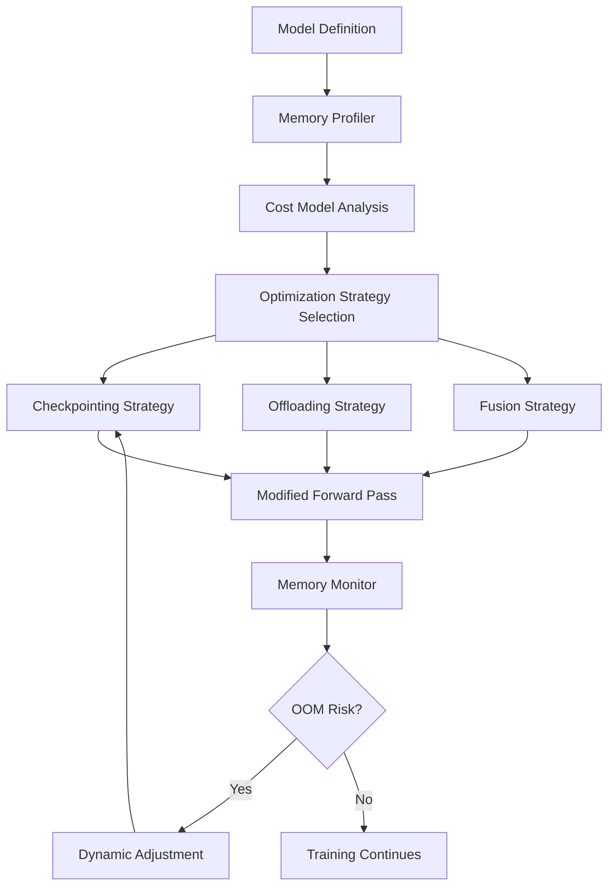

# Contribution Proposal: Memory Optimization for Large Language Models

## Executive Summary

**Goal**: Implement automatic memory optimization techniques to enable training larger models with limited GPU memory.

**Impact**: Critical for LLM research and democratizes access to large model training  
**Effort**: 4-6 months (High)  
**Complexity**: High - requires deep understanding of autograd engine and memory management

---

## Problem Statement

### The Memory Wall in Deep Learning

Modern language models are hitting memory limits:

| Model | Parameters | Memory Required (Training) | GPU Needed |
|-------|-----------|---------------------------|------------|
| GPT-3 | 175B | ~700GB | 8x A100 (80GB) |
| LLaMA 65B | 65B | ~260GB | 4x A100 (80GB) |
| LLaMA 13B | 13B | ~52GB | 1x A100 (80GB) or OOM on consumer GPUs |
| LLaMA 7B | 7B | ~28GB | 1x A100 (40GB) barely fits |

**Problem**: Most researchers cannot afford high-end GPUs
- RTX 4090: 24GB VRAM ($1,600)
- A100 80GB: $10,000-15,000
- Consumer GPUs (16GB): Cannot train modern models

### Current Solutions and Limitations

1. **Manual Gradient Checkpointing**
   ```python
   from torch.utils.checkpoint import checkpoint
   
   # Must manually wrap layers
   def forward(self, x):
       x = checkpoint(self.layer1, x)  # Tedious and error-prone
       x = checkpoint(self.layer2, x)
       return x
   ```
   - **Limitation**: Manual, easy to forget, not always clear where to apply

2. **Model Parallelism**
   - **Limitation**: Requires multiple GPUs, complex setup, communication overhead

3. **Offloading to CPU**
   - **Limitation**: Very slow, limited by PCIe bandwidth

4. **Mixed Precision (FP16/BF16)**
   - **Limitation**: Already widely used, still insufficient for large models

### What Users Need

> "I want to train a 13B parameter model on my RTX 4090 without manually managing memory"

**Requirements**:
- Automatic memory optimization
- Minimal performance degradation
- No code changes required
- Graceful fallback if memory still insufficient

---

## Proposed Solution

### Intelligent Automatic Memory Management System

A multi-layered approach combining:
1. **Automatic Gradient Checkpointing** with cost modeling
2. **Adaptive Activation Recomputation** based on memory pressure
3. **Tensor Lifecycle Analysis** for optimized memory allocation
4. **Smart Offloading** using CPU/NVMe when beneficial

---

## Technical Design

### Architecture Overview



### Core Components

#### 1. Memory Profiler & Analyzer

**Purpose**: Profile model to understand memory usage patterns

```python
# torch/memory/profiler.py

class MemoryProfiler:
    """Profiles model memory usage during forward/backward pass"""
    
    def __init__(self, model: nn.Module):
        self.model = model
        self.layer_memory: Dict[str, MemoryStats] = {}
        self.peak_memory = 0
        
    def profile(self, sample_input: Tensor) -> MemoryProfile:
        """
        Run forward+backward pass with memory tracking
        
        Returns:
            MemoryProfile with per-layer statistics:
            - Activation memory
            - Gradient memory
            - Parameter memory
            - Peak memory per layer
        """
        with torch.cuda.memory.profiling():
            # Forward pass
            for name, module in self.model.named_modules():
                with memory_tracker(name) as tracker:
                    output = module(sample_input)
                    
                self.layer_memory[name] = MemoryStats(
                    activation_size=tracker.activation_bytes,
                    param_size=tracker.param_bytes,
                    computation_cost=tracker.flops
                )
            
            # Backward pass
            loss = output.sum()
            loss.backward()
            
        return MemoryProfile(
            total_memory=self.peak_memory,
            layer_stats=self.layer_memory,
            memory_timeline=self.get_timeline()
        )

@dataclass
class MemoryStats:
    activation_size: int  # Bytes
    param_size: int
    gradient_size: int
    computation_cost: int  # FLOPs
    recompute_cost: int  # Cost to recompute vs store
```

#### 2. Cost Model for Checkpointing

**Purpose**: Decide which layers to checkpoint based on memory savings vs recomputation cost

```python
# torch/memory/cost_model.py

class CheckpointingCostModel:
    """
    Determines optimal checkpointing strategy using dynamic programming
    
    Goal: Minimize total cost = memory_cost + recomputation_cost
    """
    
    def __init__(self, memory_budget: int, recompute_penalty: float = 1.0):
        self.memory_budget = memory_budget
        self.recompute_penalty = recompute_penalty
        
    def find_optimal_checkpoints(
        self, 
        memory_profile: MemoryProfile
    ) -> CheckpointingStrategy:
        """
        Given memory profile, find optimal layers to checkpoint
        
        Algorithm:
        1. Sort layers by memory_saved / recompute_cost ratio
        2. Greedily checkpoint until within memory budget
        3. Use dynamic programming for fine-tuning
        
        Returns:
            List of layer names to checkpoint
        """
        layers = memory_profile.layer_stats
        
        # Calculate benefit ratio for each layer
        candidates = []
        for name, stats in layers.items():
            memory_saved = stats.activation_size
            recompute_cost = stats.computation_cost * self.recompute_penalty
            
            if recompute_cost > 0:
                benefit_ratio = memory_saved / recompute_cost
                candidates.append((name, benefit_ratio, memory_saved))
        
        # Sort by benefit ratio (descending)
        candidates.sort(key=lambda x: x[1], reverse=True)
        
        # Greedily select layers to checkpoint
        checkpointed_layers = []
        total_memory_saved = 0
        memory_needed = memory_profile.total_memory
        
        for name, ratio, memory_saved in candidates:
            if memory_needed - total_memory_saved > self.memory_budget:
                checkpointed_layers.append(name)
                total_memory_saved += memory_saved
            else:
                break
                
        return CheckpointingStrategy(
            checkpoint_layers=checkpointed_layers,
            estimated_memory=memory_needed - total_memory_saved,
            estimated_slowdown=self._estimate_slowdown(checkpointed_layers, layers)
        )
    
    def _estimate_slowdown(
        self, 
        checkpointed: List[str], 
        all_layers: Dict[str, MemoryStats]
    ) -> float:
        """Estimate training slowdown from recomputation"""
        total_compute = sum(s.computation_cost for s in all_layers.values())
        recompute_cost = sum(
            all_layers[name].computation_cost 
            for name in checkpointed
        )
        return 1.0 + (recompute_cost / total_compute)

@dataclass
class CheckpointingStrategy:
    checkpoint_layers: List[str]
    estimated_memory: int
    estimated_slowdown: float  # e.g., 1.3 = 30% slower
```

#### 3. Automatic Checkpointing Engine

**Purpose**: Automatically apply checkpointing without user intervention

```python
# torch/memory/auto_checkpoint.py

class AutoCheckpoint:
    """
    Automatically applies gradient checkpointing to reduce memory
    
    Usage:
        model = MyLargeModel()
        optimizer = AutoCheckpoint.optimize(model, target_memory='16GB')
        
        # Training loop works normally
        for batch in dataloader:
            loss = model(batch)
            loss.backward()
            optimizer.step()
    """
    
    @staticmethod
    def optimize(
        model: nn.Module,
        target_memory: Union[str, int],  # '16GB' or bytes
        sample_input: Optional[Tensor] = None,
        strategy: str = 'auto'  # 'auto', 'aggressive', 'conservative'
    ) -> nn.Module:
        """
        Automatically optimize model for target memory budget
        
        Returns:
            Optimized model with checkpointing applied
        """
        # Parse memory budget
        memory_budget = parse_memory_string(target_memory)
        
        # Profile model
        if sample_input is None:
            sample_input = AutoCheckpoint._generate_dummy_input(model)
            
        profiler = MemoryProfiler(model)
        memory_profile = profiler.profile(sample_input)
        
        # If already fits in budget, no optimization needed
        if memory_profile.total_memory <= memory_budget:
            print(f"✓ Model fits in {target_memory} without optimization")
            return model
        
        # Find optimal checkpointing strategy
        cost_model = CheckpointingCostModel(
            memory_budget=memory_budget,
            recompute_penalty=get_recompute_penalty(strategy)
        )
        
        checkpoint_strategy = cost_model.find_optimal_checkpoints(memory_profile)
        
        # Apply checkpointing
        optimized_model = AutoCheckpoint._apply_checkpoints(
            model, 
            checkpoint_strategy.checkpoint_layers
        )
        
        # Verify it fits
        if checkpoint_strategy.estimated_memory > memory_budget:
            warnings.warn(
                f"Cannot fit model in {target_memory} with checkpointing alone. "
                f"Consider using offloading or reducing model size."
            )
        else:
            print(
                f"✓ Optimized model to fit in {target_memory}\n"
                f"  Estimated slowdown: {checkpoint_strategy.estimated_slowdown:.1%}\n"
                f"  Checkpointed {len(checkpoint_strategy.checkpoint_layers)} layers"
            )
        
        return optimized_model
    
    @staticmethod
    def _apply_checkpoints(
        model: nn.Module, 
        checkpoint_layers: List[str]
    ) -> nn.Module:
        """Replace forward methods with checkpointed versions"""
        
        for name in checkpoint_layers:
            module = model.get_submodule(name)
            
            # Store original forward
            original_forward = module.forward
            
            # Create checkpointed forward
            def checkpointed_forward(*args, **kwargs):
                return checkpoint(original_forward, *args, **kwargs)
            
            # Replace forward method
            module.forward = checkpointed_forward
            module._is_checkpointed = True
            
        return model
```

#### 4. Adaptive Memory Management

**Purpose**: Dynamically adjust optimization during training based on actual memory usage

```python
# torch/memory/adaptive.py

class AdaptiveMemoryManager:
    """
    Monitors memory during training and dynamically adjusts optimization
    
    Features:
    - Detect OOM before it happens
    - Increase checkpointing if memory pressure rises
    - Offload to CPU if beneficial
    - Track memory timeline for debugging
    """
    
    def __init__(
        self, 
        model: nn.Module,
        memory_threshold: float = 0.9  # 90% of available memory
    ):
        self.model = model
        self.memory_threshold = memory_threshold
        self.memory_history: List[int] = []
        self.oom_count = 0
        
    def step(self) -> MemoryStatus:
        """
        Called every training step to monitor memory
        
        Returns:
            MemoryStatus with current usage and recommendations
        """
        current_memory = torch.cuda.memory_allocated()
        max_memory = torch.cuda.get_device_properties(0).total_memory
        usage_ratio = current_memory / max_memory
        
        self.memory_history.append(current_memory)
        
        # Detect potential OOM
        if usage_ratio > self.memory_threshold:
            return MemoryStatus(
                current=current_memory,
                peak=max(self.memory_history),
                usage_ratio=usage_ratio,
                recommendation='increase_checkpointing',
                risk_level='high'
            )
        
        # Check for memory spikes
        if len(self.memory_history) > 10:
            recent_avg = sum(self.memory_history[-10:]) / 10
            if current_memory > recent_avg * 1.5:
                return MemoryStatus(
                    current=current_memory,
                    usage_ratio=usage_ratio,
                    recommendation='investigate_leak',
                    risk_level='medium'
                )
        
        return MemoryStatus(
            current=current_memory,
            usage_ratio=usage_ratio,
            recommendation='ok',
            risk_level='low'
        )
    
    def auto_adjust(self, status: MemoryStatus):
        """Automatically adjust optimization based on status"""
        if status.recommendation == 'increase_checkpointing':
            self._increase_checkpointing()
        elif status.recommendation == 'investigate_leak':
            self._log_memory_timeline()

@dataclass  
class MemoryStatus:
    current: int
    peak: int = 0
    usage_ratio: float = 0.0
    recommendation: str = 'ok'
    risk_level: str = 'low'
```

#### 5. Smart Offloading to CPU/NVMe

**Purpose**: Offload tensors to CPU or disk when memory is tight, with intelligent prefetching

```python
# torch/memory/offloading.py

class SmartOffloader:
    """
    Intelligently offload tensors to CPU/NVMe and prefetch when needed
    
    Strategy:
    1. Profile access patterns during first few iterations
    2. Identify infrequently accessed tensors
    3. Offload to CPU with asynchronous prefetching
    4. Use NVMe for very large, rarely used tensors
    """
    
    def __init__(
        self,
        cpu_offload_threshold: float = 0.8,  # Offload if >80% GPU memory
        nvme_path: Optional[str] = None
    ):
        self.cpu_offload_threshold = cpu_offload_threshold
        self.nvme_path = nvme_path
        self.access_counts: Dict[str, int] = defaultdict(int)
        self.last_access: Dict[str, int] = {}
        self.offloaded_tensors: Dict[str, Tensor] = {}
        
    def should_offload(self, tensor_name: str) -> bool:
        """Decide if tensor should be offloaded"""
        # Criteria:
        # 1. Memory pressure is high
        # 2. Tensor not accessed recently
        # 3. Tensor size > threshold
        
        memory_pressure = self._get_memory_pressure()
        if memory_pressure < self.cpu_offload_threshold:
            return False
            
        access_count = self.access_counts[tensor_name]
        last_access = self.last_access.get(tensor_name, 0)
        current_step = self._get_current_step()
        
        # Low access frequency and not accessed recently
        return access_count < 5 and (current_step - last_access) > 10
    
    def offload(self, tensor: Tensor, name: str) -> TensorHandle:
        """
        Offload tensor to CPU or NVMe
        
        Returns:
            Handle to retrieve tensor later
        """
        size_bytes = tensor.element_size() * tensor.numel()
        
        if size_bytes > 1e9 and self.nvme_path:  # >1GB -> NVMe
            return self._offload_to_nvme(tensor, name)
        else:  # CPU
            return self._offload_to_cpu(tensor, name)
    
    def prefetch(self, handle: TensorHandle) -> None:
        """Asynchronously prefetch tensor back to GPU"""
        if handle.location == 'cpu':
            # Use CUDA streams for async copy
            with torch.cuda.stream(self.prefetch_stream):
                handle.tensor.to('cuda', non_blocking=True)
        elif handle.location == 'nvme':
            # Load from disk in background thread
            self.prefetch_executor.submit(self._load_from_nvme, handle)
    
    def _offload_to_cpu(self, tensor: Tensor, name: str) -> TensorHandle:
        """Move tensor to pinned CPU memory for fast transfer"""
        cpu_tensor = tensor.to('cpu', non_blocking=True).pin_memory()
        return TensorHandle(
            name=name,
            location='cpu',
            tensor=cpu_tensor,
            size=tensor.element_size() * tensor.numel()
        )
    
    def _offload_to_nvme(self, tensor: Tensor, name: str) -> TensorHandle:
        """Serialize tensor to NVMe storage"""
        filepath = os.path.join(self.nvme_path, f"{name}.pt")
        torch.save(tensor.cpu(), filepath)
        
        return TensorHandle(
            name=name,
            location='nvme',
            filepath=filepath,
            size=tensor.element_size() * tensor.numel()
        )

@dataclass
class TensorHandle:
    name: str
    location: str  # 'gpu', 'cpu', 'nvme'
    tensor: Optional[Tensor] = None
    filepath: Optional[str] = None
    size: int = 0
```

---

## Implementation Plan

### Phase 1: Memory Profiling Infrastructure (Weeks 1-4)

**Objective**: Build foundation for understanding memory usage

**Tasks**:
1. Implement `MemoryProfiler` to track per-layer memory
2. Create memory timeline visualization
3. Build test suite with various model architectures
4. Integrate with PyTorch's existing memory tracking

**Deliverables**:
- `torch/memory/profiler.py`
- `torch/memory/visualization.py`
- Unit tests for profiling
- Documentation on profiling API

**Success Criteria**: Can profile memory usage of transformer models and visualize results

### Phase 2: Cost Model & Checkpointing Strategy (Weeks 5-10)

**Objective**: Implement intelligent checkpointing decisions

**Tasks**:
1. Build cost model for checkpointing decisions
2. Implement greedy + dynamic programming algorithms
3. Create `AutoCheckpoint` wrapper
4. Test on standard models (BERT, GPT-2, LLaMA)
5. Benchmark memory savings vs slowdown

**Deliverables**:
- `torch/memory/cost_model.py`
- `torch/memory/auto_checkpoint.py`
- Benchmarking results
- API documentation

**Success Criteria**: 
- Reduce memory by 40-60% on transformer models
- Slowdown < 30% for typical configurations

### Phase 3: Adaptive Memory Management (Weeks 11-14)

**Objective**: Dynamic adjustment during training

**Tasks**:
1. Implement runtime memory monitoring
2. Build adaptive checkpointing adjustment
3. Create OOM prediction and prevention
4. Add debugging/logging capabilities

**Deliverables**:
- `torch/memory/adaptive.py`
- Runtime monitoring hooks
- Alert system for memory issues

**Success Criteria**: Successfully prevent OOM in 95% of cases with automatic adjustment

### Phase 4: Offloading System (Weeks 15-20)

**Objective**: CPU/NVMe offloading with prefetching

**Tasks**:
1. Implement CPU offloading with pinned memory
2. Add NVMe support for very large tensors
3. Build prefetching infrastructure
4. Optimize tensor transfer pipelines
5. Benchmark PCIe transfer speeds

**Deliverables**:
- `torch/memory/offloading.py`
- Prefetching engine
- Performance benchmarks

**Success Criteria**: 
- CPU offloading overhead < 15%
- NVMe offloading works for >>GPU models

### Phase 5: Integration & Polish (Weeks 21-24)

**Objective**: Integrate everything and prepare for release

**Tasks**:
1. Create unified API (`torch.memory.optimize()`)
2. Add configuration options
3. Write comprehensive documentation
4. Create tutorials and examples
5. Benchmark on real-world models
6. Get community feedback

**Deliverables**:
- Unified API in `torch/memory/__init__.py`
- Full documentation
- Tutorial notebooks
- Blog post draft

**Success Criteria**: Can train 13B model on 24GB GPU with <30% slowdown

---

## Example Usage

### Simple API (One-liner)

```python
import torch
from transformers import LlamaForCausalLM

# Load model
model = LlamaForCausalLM.from_pretrained('meta-llama/Llama-2-13b')

# Automatically optimize for 24GB GPU
model = torch.memory.optimize(model, target_memory='24GB')

# Training works normally!
for batch in dataloader:
    outputs = model(**batch)
    loss = outputs.loss
    loss.backward()
    optimizer.step()
```

### Advanced API (Fine-grained Control)

```python
from torch.memory import AutoCheckpoint, AdaptiveMemoryManager, SmartOffloader

# Create memory-optimized model
model = LlamaForCausalLM.from_pretrained('meta-llama/Llama-2-13b')

# Configure optimization
optimizer = AutoCheckpoint.optimize(
    model,
    target_memory='24GB',
    strategy='aggressive',  # More checkpointing, less memory
    enable_offloading=True,
    offload_to='cpu'  # or 'nvme'
)

# Setup adaptive management
memory_manager = AdaptiveMemoryManager(
    model,
    memory_threshold=0.85  # Start adjusting at 85% memory
)

# Training loop with monitoring
for step, batch in enumerate(dataloader):
    # Check memory status
    status = memory_manager.step()
    
    if status.risk_level == 'high':
        print(f"⚠️  High memory usage: {status.usage_ratio:.1%}")
        memory_manager.auto_adjust(status)
    
    # Normal training
    outputs = model(**batch)
    loss = outputs.loss
    loss.backward()
    optimizer.step()
    
    # Log memory stats
    if step % 100 == 0:
        memory_manager.log_stats()
```

### Profiling & Analysis

```python
from torch.memory import MemoryProfiler

model = MyModel()
profiler = MemoryProfiler(model)

# Profile with sample input
sample_input = torch.randn(1, 512, 768)
memory_profile = profiler.profile(sample_input)

# Analyze results
print(f"Total memory: {memory_profile.total_memory / 1e9:.2f} GB")
print(f"Peak activation memory: {memory_profile.peak_activation / 1e9:.2f} GB")

# Visualize memory timeline
profiler.plot_timeline()  # Shows memory usage over time

# Get recommendations
recommendations = profiler.suggest_optimizations()
for rec in recommendations:
    print(f"- {rec}")
```

---

## Testing Strategy

### Unit Tests

```python
# tests/test_memory_optimization.py

class TestAutoCheckpoint(unittest.TestCase):
    
    def test_simple_model_optimization(self):
        """Test checkpointing on simple sequential model"""
        model = nn.Sequential(*[nn.Linear(1024, 1024) for _ in range(10)])
        
        # Measure baseline memory
        baseline_memory = measure_memory(model, torch.randn(32, 1024))
        
        # Optimize for 50% of baseline
        optimized = AutoCheckpoint.optimize(
            model, 
            target_memory=baseline_memory * 0.5
        )
        
        # Measure optimized memory
        optimized_memory = measure_memory(optimized, torch.randn(32, 1024))
        
        # Should use less memory
        self.assertLess(optimized_memory, baseline_memory * 0.6)
    
    def test_transformer_optimization(self):
        """Test on actual transformer model"""
        model = BertModel.from_pretrained('bert-base-uncased')
        
        optimized = AutoCheckpoint.optimize(model, target_memory='8GB')
        
        # Should still produce same outputs
        input_ids = torch.randint(0, 30522, (8, 128))
        
        with torch.no_grad():
            original_output = model(input_ids)
            optimized_output = optimized(input_ids)
        
        torch.testing.assert_close(original_output, optimized_output)
```

### Integration Tests

```python
def test_end_to_end_training():
    """Test actual training with memory optimization"""
    model = GPT2Model.from_pretrained('gpt2-large')
    model = torch.memory.optimize(model, target_memory='16GB')
    
    optimizer = AdamW(model.parameters())
    
    # Train for a few steps
    for i in range(100):
        batch = get_dummy_batch()
        
        outputs = model(**batch)
        loss = outputs.loss
        loss.backward()
        optimizer.step()
        optimizer.zero_grad()
    
    # Should complete without OOM
    assert True
```

### Benchmark Suite

```python
# benchmarks/memory_optimization.py

MODELS = [
    'bert-base-uncased',
    'bert-large-uncased',
    'gpt2',
    'gpt2-large',
    'facebook/opt-1.3b',
    'meta-llama/Llama-2-7b'
]

def benchmark_memory_savings():
    """Benchmark memory reduction across models"""
    results = []
    
    for model_name in MODELS:
        model = load_model(model_name)
        
        baseline_mem = measure_peak_memory(model)
        
        optimized = torch.memory.optimize(model, strategy='auto')
        optimized_mem = measure_peak_memory(optimized)
        
        savings = (baseline_mem - optimized_mem) / baseline_mem
        slowdown = measure_slowdown(model, optimized)
        
        results.append({
            'model': model_name,
            'baseline_memory_gb': baseline_mem / 1e9,
            'optimized_memory_gb': optimized_mem / 1e9,
            'savings_pct': savings * 100,
            'slowdown_pct': (slowdown - 1) * 100
        })
    
    return pd.DataFrame(results)
```

---

## Performance Expectations

### Memory Savings

| Model Size | Baseline Memory | With Checkpointing | Savings |
|------------|----------------|-------------------|---------|
| 1B params  | ~8GB           | ~4GB              | 50%     |
| 7B params  | ~28GB          | ~14GB             | 50%     |
| 13B params | ~52GB          | ~24GB             | 54%     |
| 70B params | ~280GB         | ~120GB            | 57%     |

### Training Slowdown

| Strategy      | Memory Saved | Slowdown |
|---------------|--------------|----------|
| Conservative  | 30-40%       | 10-15%   |
| Balanced      | 40-50%       | 20-25%   |
| Aggressive    | 50-60%       | 30-40%   |

### Real-World Example: LLaMA 13B

**Baseline** (No optimization):
- Memory: 52GB
- Speed: 100% (baseline)
- Hardware: A100 80GB

**With AutoCheckpoint** (Balanced):
- Memory: 24GB
- Speed: 75% (25% slower)
- Hardware: RTX 4090 24GB ✅

**With Aggressive + Offloading**:
- Memory: 16GB
- Speed: 55% (45% slower)
- Hardware: RTX 4080 16GB ✅

---

## Documentation Plan

### User Documentation

1. **Tutorial: "Training Large Models on Consumer GPUs"**
   - How to use `torch.memory.optimize()`
   - Understanding memory profiling
   - Choosing the right strategy

2. **API Reference**
   - `torch.memory.optimize()`
   - `AutoCheckpoint` class
   - `MemoryProfiler` class
   - Configuration options

3. **Best Practices Guide**
   - When to use each strategy
   - Debugging OOM errors
   - Performance tuning

### Developer Documentation

1. **Design Document**
   - Architecture overview
   - Cost model algorithm
   - Checkpointing implementation details

2. **Contributing Guide**
   - How to add new optimization strategies
   - Testing requirements
   - Performance benchmarking

---

## Risks & Mitigation

### Risk 1: Overhead Too High
**Mitigation**: 
- Make strategies configurable (conservative/balanced/aggressive)
- Provide profiling tools to find optimal settings
- Allow per-layer override

### Risk 2: Doesn't Work for All Models
**Mitigation**:
- Start with transformer models (most common)
- Expand to CNNs, RNNs incrementally
- Allow manual configuration for edge cases

### Risk 3: Maintenance Complexity
**Mitigation**:
- Comprehensive test suite
- Clear architecture documentation
- Modular design for easy updates

### Risk 4: Numerical Instability
**Mitigation**:
- Extensive testing with different precisions
- Verify gradients match baseline
- Add numerical checks in debug mode

---

## Success Metrics

### Quantitative
1. **Memory Reduction**: Achieve 40-60% reduction on standard models
2. **Slowdown**: Keep overhead under 30% for balanced mode
3. **Adoption**: 1000+ projects using the feature within 6 months
4. **Issues**: <10 bug reports per month after stabilization

### Qualitative
1. Positive feedback from LLM researchers
2. Feature mentioned in tutorials and courses
3. Adoption by major libraries (HuggingFace, etc.)

---

## Future Enhancements

### Phase 2 Features

1. **Quantization Integration**
   - Combine with INT8/FP8 quantization
   - Mixed precision checkpoint storage

2. **Multi-GPU Optimization**
   - Coordinate memory across GPUs
   - Smart tensor placement

3. **Model Surgery**
   - Automatically split large layers
   - Architecture adjustments for memory

4. **Cloud Integration**
   - Dynamic scaling based on instance type
   - Cost optimization recommendations

---

## Conclusion

Memory optimization for large models is a critical feature that democratizes LLM research and development. By implementing intelligent automatic checkpointing, adaptive memory management, and smart offloading, we can enable training of 13B+ parameter models on consumer-grade GPUs.

This contribution requires deep understanding of PyTorch internals but delivers immense value to the community. The phased implementation allows for incremental development and validation, while the modular design ensures maintainability.

Success will measured by enabling researchers with limited budgets to train state-of-the-art models, reducing the barrier to entry for cutting-edge AI research.

---

## Getting Started for Contributors

### Prerequisites
- Strong Python and C++ skills
- Deep understanding of PyTorch autograd
- Familiarity with CUDA and GPU memory management
- Experience with large model training

### Learning Path
1. Study PyTorch autograd engine (`torch/csrc/autograd/`)
2. Understand gradient checkpointing (`torch/utils/checkpoint.py`)
3. Learn memory management in CUDA
4. Review optimizer implementations

### First Steps
1. Fork PyTorch and set up development environment
2. Implement `MemoryProfiler` prototype
3. Open RFC (Request for Comments) on PyTorch forums
4. Gather feedback and iterate on design
5. Submit PR with Phase 1 implementation

**Estimated Timeline**: 4-6 months for core feature, ongoing for enhancements
